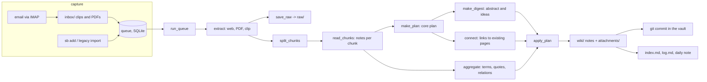

# Internals

How esbi-cli works inside, and why it is built this way. For using it, read [Getting started](../tutorials/getting-started.md), [How do I...?](../how-to/index.md) and the [command reference](../reference/cli.md). For what is unfinished, read [Known limits](#known-limits) below.

## The idea in one paragraph

The pattern is Karpathy's LLM Wiki: `raw/` holds the originals and is never edited; `wiki/` holds notes the worker writes and maintains; `SCHEMA.md` holds the conventions the model is given. A Python worker does the file work. A language model only ever **returns JSON**, which the worker validates and then applies. The model never touches a file and never calls a tool, so it works with small local models.

## Data flow



One source, step by step (`ingest/pipeline.py`):

1. **Extract** (`extract/`): a URL becomes text with trafilatura (and up to five article image links); a PDF becomes Markdown with pymupdf4llm plus up to eight figures; a Web Clipper note is read from its own body. Every URL the worker fetches itself goes through `netguard.safe_get`: `http(s)` only, public addresses only, every redirect re-checked.
2. **Deduplicate**: by URL and by a hash of the text. A duplicate is skipped with no model call.
3. **Read** (`ingest/chunks.py`, `ingest/read.py`): a source longer than `max_source_chars` is cut into chunks at paragraph boundaries, the references section is dropped, and past `max_chunks` the start, the end and an even spread of the middle are kept. The reading model takes notes on each chunk: points, terms, verbatim quotes, relations. A chunk it cannot read is skipped with a warning.
4. **Retrieve** (`ingest/retrieve.py`, `index.py`): the worker finds existing pages that may relate to this source with SQLite full-text search (FTS5) over a persistent index that is kept in step with the files by their size and modification time. Page lookups by name and source lookups by URL or hash use the same index.
5. **Plan** (`ingest/plan.py`): the writing model gets the notes (not the raw text) and the *titles* of candidate pages, and returns a core plan: title, one-liner, summary, key points, tags, concepts, entities.
6. **Digest** (`ingest/digest.py`): a second, small call writes the detailed summary, key ideas and open questions. Terms, quotes and diagram relations are not asked of the model again: code merges what the chunk notes already contain.
7. **Connect** (`ingest/connect.py`): a third call is shown the existing pages *with* their one-liners and says how the new source relates to them, with the reason.
8. **Apply** (`ingest/apply.py`): the only module that writes wiki pages. It checks every claim before writing (see "Trust model") and then writes the source note, creates or extends concept and entity pages, writes figures into `attachments/`, and records what it did.
9. **Report** (`report/`): `index.md`, `log.md`, and the daily note are regenerated. The vault is committed to git.

## State: where everything lives

| What | Where | Owner |
|---|---|---|
| Originals | `vault/raw/` (PDFs and Markdown snapshots) | Written once, never edited |
| Notes | `vault/wiki/{sources,concepts,entities,syntheses}/` | The worker; you may edit |
| Figures | `vault/attachments/<source>/` | The worker |
| Daily index | `vault/wiki/daily/YYYY-MM-DD.md` | Regenerated; your ticks are the only input |
| Home page | `vault/Home.md`, between the two marker comments | The block is the worker's; the rest is yours |
| Review items | `vault/wiki/review/` | The worker puts things here; you resolve them |
| Queue | `vault/.esbi/queue.sqlite3` | The worker |
| Page index (names, URLs, hashes, full text) | `vault/.esbi/index.sqlite3` | The worker; disposable, rebuilt from the vault if deleted |
| Run history | `vault/.esbi/runs.jsonl` | The worker |
| Lock | `vault/.esbi/run.lock` (`flock`) | A crashed run cannot leave it stuck |
| Mail password | macOS Keychain, service `esbi-cli-imap` | Never in a file |
| Settings | `config.toml` (git-ignored) | You |

The vault is its own git repository, separate from the code. Each ingested source is one commit there, so any change can be reviewed or reverted.

## Design decisions, and why

**The model returns JSON, the worker writes files.** Small local models cannot be trusted with file tools, but they can fill a schema. The schema (`llm/schemas.py`, pydantic) is the contract, and it is also what the model is given as a JSON schema, so the model's decoder is constrained to it. Every list in the schema has a `maxItems`: measured on a 3B model, without it a chunk's notes ran away in 3 of 4 cases.

**Reading is separate from writing.** A shallow summary was a reading problem: the model saw only the first 12k characters of sources whose median is 47k. Long sources are read in full, in chunks, by a cheap model; the writing model works from the notes. They can be two different models (`[llm.summarize]` reads, `[llm.synthesize]` writes) or the same one with different limits.

**One job per model call.** One giant plan left the abstract empty. The core plan, the digest and the connections are three small calls; code does the merging that needs no model. Connections are a separate call because showing a small model existing pages while it summarizes makes it copy their wording into the new note.

**Trust model: the worker checks what the model claims.**

| Claim | Check |
|---|---|
| A quote | Must appear verbatim in the source (ignoring case and accents) |
| A glossary term | Must appear in the source text |
| An entity (person, tool, company) | Its name or an alias must appear in the source text |
| A link to a page | Must resolve to a real page, or it is dropped |
| A concept named like a source | Skipped: Obsidian resolves `[[links]]` by filename across folders, so it would be ambiguous |
| The language | The notes' language (`[notes].language`), with one retry; a second failure is accepted and reported. The check is a count of common words, so a language without a word list is never judged |
| A one-line summary that is a URL, a label or the title | Replaced by the first sentence of the summary |
| The concept diagram | Drawn by code from the extracted relations, so the Mermaid syntax is always valid |

**Risky changes go to review, never silently.** Contradictions and lint findings become notes under `wiki/review/`. The worker deletes nothing of yours. Contradiction flagging is off by default because small models flag tenuous ones.

**A model timeout is not "the model is down".** `LLMTimeout` fails one chunk or one source and the run goes on. Only a real connection failure stops a run, and then nothing is counted against the sources.

**The daily note is a view, not a document.** It is regenerated from state (source frontmatter plus the queue) on every run. The only thing read back from it is your `- [x]` ticks, before each regeneration. The worker never depends on text it wrote earlier in that note.

**Idempotent by default.** The same link twice is one queue item (tracking parameters, case and trailing slash are normalized). The same PDF twice is recognized by its bytes. A different PDF with the same file name is kept as `name (2).pdf`. `raw/` is never overwritten.

**Scheduling uses the calendar, not an interval.** The nightly job is a launchd `StartCalendarInterval` at `[run].nightly_time` (default 03:00), which launchd runs at the next wake if the Mac was asleep. An hourly interval and run-at-load are only a retry net, because launchd drops interval ticks that fall while the Mac sleeps. `--if-due` makes the job do real work once per day. The run is wrapped in `caffeinate -i`.

**Social posts and YouTube are captured by hand.** Through the Obsidian Web Clipper; the worker does not scrape. The clipped text is the source.

## `sb reingest`: how a rebuild stays safe

1. Commit the vault and tag it `pre-reingest-<date>` (an existing tag means a resumed run, and the first tag is the true "before").
2. For each note not yet at `format: 2` (or matching the titles given): read its original from `raw/` (a PDF is re-extracted, so figures come back).
3. Run the normal pipeline with the old title (so existing `[[links]]` stay valid) and the old raw path.
4. Only once the new plan exists, `before_write` removes what the old note added elsewhere: its `## From [[note]]` sections in concept pages (in any language the vault was written in), and any concept page nobody else cites. A model failure before that point leaves the old note untouched.
5. Restore `status`, `read`, `captured`, `content_hash`; merge tags; mark `format: 2`; commit.

Because the marker is the note's own frontmatter, an interrupted rebuild resumes by running the command again.

## Code map

```
src/esbi_cli/
  cli.py            Typer commands; the menu re-invokes them (no logic of its own)
  config.py         config.toml -> Config; find_config() is the single answer to "which config"
  doctor.py         sb doctor
  vault.py          Page/Vault: frontmatter, safe titles, find/resolve page, free_path
  gitops.py         commit only worker-managed paths
  queue.py          SQLite queue: claim, release, fail, complete; migrates old schemas
  run.py            drain the queue within limits, isolate failures per source
  runlock.py runlog.py schedule.py   flock, run history and due-ness, launchd plist
  reingest.py       rebuild notes from raw/
  netguard.py       safe fetching: public addresses only, redirects re-checked
  capture/          inbox scan, one-time import of an older folder of links and PDFs
  extract/          html (trafilatura), pdf (pymupdf4llm + figures), clip (Web Clipper notes), image (OCR)
  mail/             IMAP client (peek only), mail -> clip note, fetch with dedupe
  ingest/           chunks, read, plan, digest, connect, retrieve (FTS5), apply, pipeline
  llm/              adapter (ollama, lmstudio, openai-compatible, anthropic, claude-cli), schemas (the contract)
  report/           daily index, index.md, read-state sync
  lint/             deterministic checks and the Lint.md report
  ask/              sb ask: retrieval, grounded answer, citation checks
  bench/            sb bench: compare models on your own material
```

## Testing

`uv run pytest` and `uv run ruff check .`. Tests sit at a few seams, not at every function:

- the queue (`Queue`), capture (`scan_inbox`, `import_legacy`, clip extraction), `run_queue` (which takes an injected `ingest_fn`), the ingest pipeline, and the CLI wiring, where only the model is faked (`cli.make_llm`);
- `FakeLLM` returns queued JSON payloads in order and records the prompts it was given; there are also fakes for IMAP, the Keychain and `launchctl`, so no test touches the real mailbox, Keychain or launchd;
- the guards (quotes, terms, entities, language, one-liners) have tests that fail when the guard is removed, which was checked by breaking each one on purpose.

A test must never run against your real vault. To try real models, use a scratch copy of the vault and a config pointing at it.

## How to extend it

**A new kind of source.** Add an extractor that returns an `ExtractedDoc` (`title`, `text`, `kind`, `url`, optional `pdf_bytes`, `figures`, `image_links`), and route to it from `extract_source` or from the clip reader. Everything after extraction is shared. Keep the rule that the worker only fetches public `http(s)` addresses through `netguard`.

**A new model provider.** Implement `complete_json(system, user, schema) -> str` and `tokens_used`, and add the provider to `make_llm` in `llm/adapter.py`. Nothing else knows which provider is in use.

**A change to the note layout.** Edit `apply_plan`, bump `NOTE_FORMAT` in `ingest/apply.py`, and run `sb reingest` to bring older notes to the new layout. The bump is what marks old notes as needing a rebuild.

**A change to what the model is asked.** Edit the prompt in the module that owns it and the schema in `llm/schemas.py`. Add the field's bound (`maxItems`) and a check in `apply_plan` if the field makes a claim about the source.

## Known limits

Open work is in the issue tracker. The main ones: quality is bounded by the model (a 3B model writes useful but unpolished notes); retrieval is by keyword unless you turn on [search by meaning](../how-to/ask-your-wiki.md#search-by-meaning); sources past `max_chunks` are sampled; vector figures in PDFs are not extracted; scanned PDFs and images are read only with an OCR model configured (small vision model: it can miss or swap words in dense small print, reads no handwriting reliably, and photos with no text are rejected, not described).
